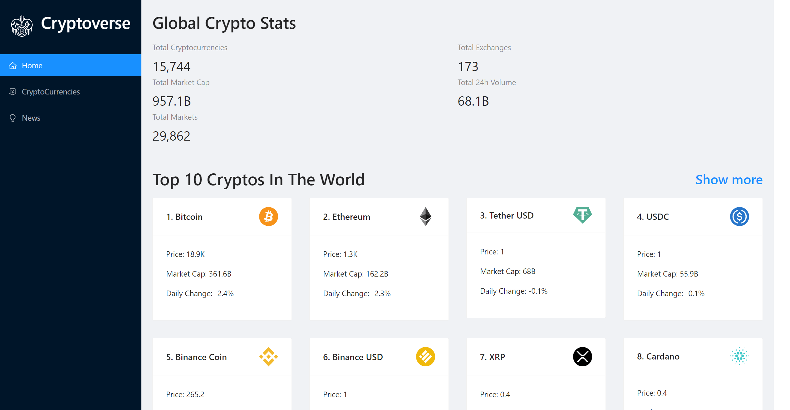
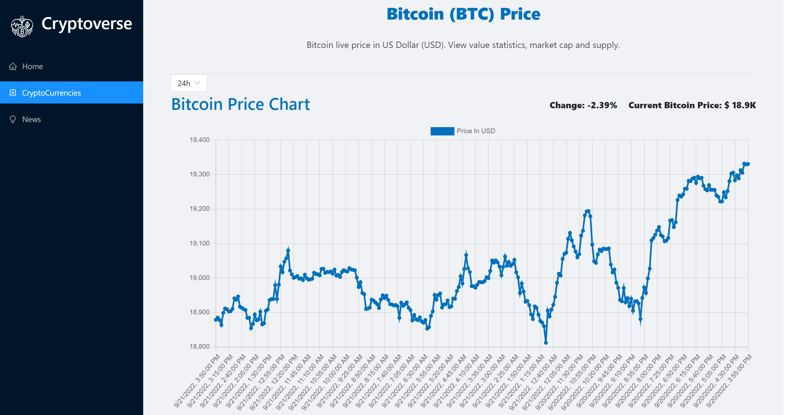

# Cryptoverse

[Deployemnt link](https://projectcryptoverseapp.netlify.app//)

A React application provides the latest crypto prices,Taught by Javascript Mastery.

## Preview

&nbsp;

## Built with

- [React](https://reactjs.org/)
- [React-router](https://reactrouter.com/) v6
- [Redux Toolkit](https://redux-toolkit.js.org/) (include [RTK Query](https://redux-toolkit.js.org/rtk-query/overview))
- [Chart.js](https://www.chartjs.org/) from [react-chartjs-2](https://www.npmjs.com/package/react-chartjs-2)
- [Coinranking API](https://rapidapi.com/Coinranking/api/coinranking1?utm_source=youtube.com%2FJavaScriptMastery&utm_medium=DevRel&utm_campaign=DevRel)
- [Ant Design](https://ant.design/)

## License

[MIT](LICENSE)
